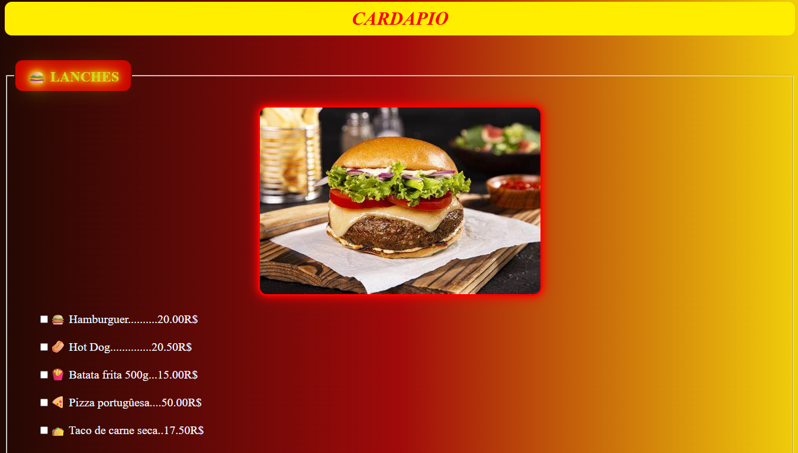

# Cardapio Online

> Este projeto simula um site de delivery de comida, ele separa as comidas por categorias e possui uma parte dedicada para a entrega.

### Ajustes e melhorias

O projeto ainda está em desenvolvimento e as próximas atualizações serão voltadas para as seguintes tarefas:

- [x] estrutura principal do site
- [x] separação dos tipos de comida
- [x] adição de css
- [x] adição da pagina de entrega
- [ ] adiçao de js e uma pagina dedicada ao pagamento

